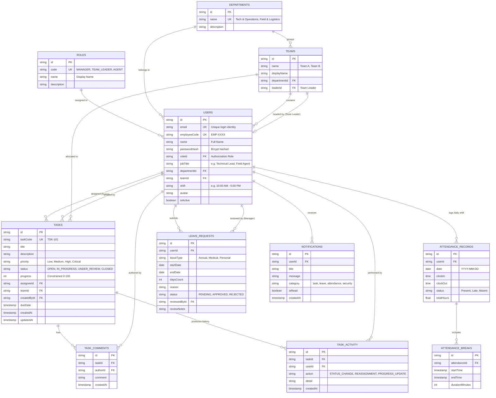
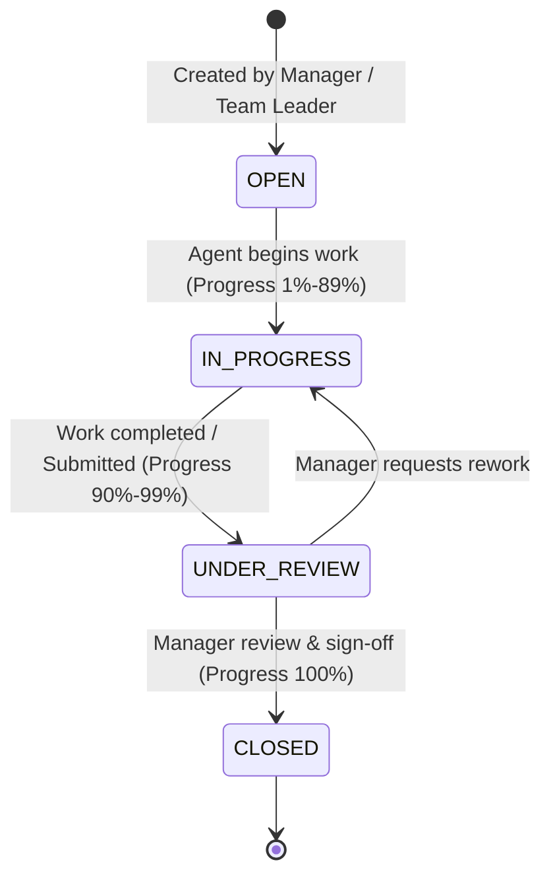

# GESF Internal Operations Platform — PostgreSQL ER Diagram & Data Model
**Document Code:** GESF-SD-BE-01 | **Milestone:** Day 2 Delivery

---

## 1. Entity-Relationship Diagram (Mermaid)

---

## 2. Canonical Task Lifecycle

---

## 3. Relational Table Specifications

1. **`roles`**: Decouples authorization privileges (`MANAGER`, `TEAM_LEADER`, `AGENT`) from variable job title strings.
2. **`departments`**: Top-level administrative groupings.
3. **`teams`**: Operational squads with explicit 1:1 Team Leader relationship (`leaderId`).
4. **`users`**: Secure employee identities with unique email, unique employee codes, and bcrypt-hashed passwords.
5. **`tasks`**: Operational incident and maintenance tasks constrained with 0-100% progress and relational audit logs.
6. **`task_comments`**: Chronological discussion threads.
7. **`task_activity`**: Immutable audit history tracking every status, assignment, and progress update.
8. **`attendance_records` & `attendance_breaks`**: Granular work duration and break intervals.
9. **`leave_requests`**: Two-phase approval workflow.
10. **`notifications`**: Per-user targeted inbox messages.
